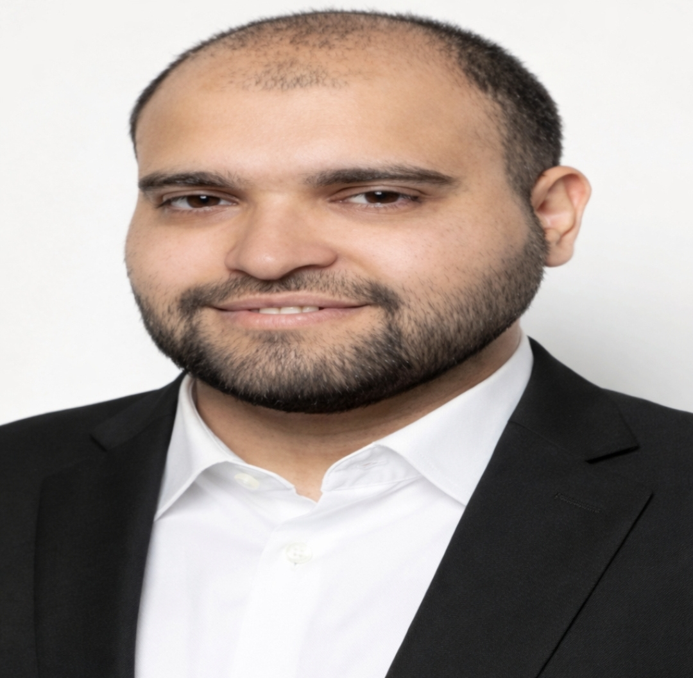

# My Portfolio

Professional portfolio website of Ahmed Lojain Alabdullah Alshuaib.

## About Me

Computer Engineer and Fullstack Web Developer with a strong interest in software development, web technologies, databases, Linux systems, and modern IT solutions.

I completed a Fullstack Web Development training program at DCI Düsseldorf and gained practical experience through an internship at Stero GmbH in Germany.

Currently seeking opportunities in:

* Software Development
* Web Development
* IT Support
* QA Testing
* System Administration
* Database Administration

---

## Education

### Computer Engineering

Al-Ittihad University
2007 – 2013

### Fullstack Web Development

DCI Düsseldorf
2019 – 2020

---

## Professional Experience

### Stero GmbH – Internship

Velbert, Germany

Tasks included:

* Software Testing
* Technical Documentation
* IT Support Activities
* Team Collaboration

---

## Technical Skills

### Frontend

* HTML
* CSS
* JavaScript
* Bootstrap
* React

### Backend

* Node.js
* Express.js
* PHP

### Databases

* MySQL
* MongoDB
* Oracle Database

### Tools

* Git
* GitHub
* Postman
* Visual Studio Code

### Operating Systems

* Linux
* Windows

---

## Self-Study Projects

### Public Service Management System (PSMS)

Administrative platform for managing public service workflows.

### Digital Banking Simulation System

Simulation of banking operations and account management.

### Biometric Authentication Simulation System

Authentication system based on biometric verification concepts.

### Transport Logistics Simulation System

Transport and logistics management platform simulation.

### Smart Data Entry Processing System

Automated data collection and processing workflows.

### Restaurant Reservation System

Restaurant booking and reservation management solution.

### Customer Relationship Management (CRM) System

Customer management and communication platform.

---

## Languages

* Arabic
* German
* English

---

## Portfolio Website

https://ahmdljyn.github.io/My-Portfolio/

---

## Contact

📧 Email:
[cmpeng.ahmdljyn@gmail.com](mailto:cmpeng.ahmdljyn@gmail.com)

📍 Location:
Velbert, Germany

💬 WhatsApp:
+49 162 3693690

---

## Career Objective

Seeking opportunities in Software Development, Web Development, IT Support, QA Testing, System Administration, and related IT fields.

Open to internships, trainee programs, junior positions, and long-term employment opportunities in Germany.

---

## License

This portfolio project is intended for professional presentation and personal branding purposes.
